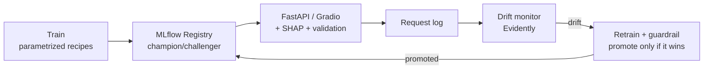

# Credit Distress — an ML system in production

End-to-end ML system that predicts a borrower's risk of financial distress on
**imbalanced** credit data — built to demonstrate *production* ML: train, serve, explain,
monitor for drift, and retrain behind a safety guardrail, with CI and a live demo.

> **Live demo:** https://huggingface.co/spaces/gauravk26/credit_distress · **Dataset:** Give Me Some Credit (150k borrowers, ~7% default)

## Architecture



## What it does

- **Handles imbalance honestly** — PR-AUC (not accuracy), class weighting, cost-based threshold.
- **Serves live** — a calibrated probability, a decision, and a per-prediction **SHAP** explanation.
- **Trustworthy probabilities** — Platt calibration (a predicted 0.30 means ~30%).
- **Detects drift** — logs every request, compares live inputs to training (Evidently / PSI).
- **Retrains safely** — champion/challenger guardrail promotes only if the new model beats the
  incumbent on a sealed test set; rollback is a one-line registry-alias move.

## Model progression (validation PR-AUC, lazy baseline 0.067)

| iteration | change | PR-AUC |
|---|---|---|
| baseline | logistic regression | 0.241 |
| class weights | treat defaulters ~14× | 0.294 |
| clipped | cap outliers | 0.369 |
| XGBoost | boosted trees | 0.381 |
| **champion** | XGBoost **+ Platt calibration** | 0.407 (test) |

## Layout

| path | what |
|---|---|
| `src/train.py` | one parametrized trainer (recipes: baseline / weighted / clipped / xgboost / xgboost_fe) |
| `src/serve.py` | FastAPI service — loads `@champion` from the registry, `/predict`, logging, SHAP |
| `src/monitor.py`, `retrain_on_drift.py`, `auto_retrain.py` | drift detection + champion/challenger retrain |
| `serving/` | self-contained Docker service (FastAPI + model snapshot) |
| `space/` | the live Gradio demo (deployed to Hugging Face) |
| `tests/` | unit + smoke tests |
| `.github/workflows/ci.yml` | runs the tests on every push |

## Quickstart

```bash
pip install -r requirements.txt
python src/train.py all             # train every recipe
uvicorn src.serve:app --port 8137   # serve the champion -> http://localhost:8137/docs
python src/auto_retrain.py          # drift -> challenger -> guardrail decides
PYTHONPATH=src python -m pytest tests/ -q
```

## Engineering highlights

- **Input drift ≠ model degradation:** retraining is gated by a performance guardrail, not
  triggered by input drift alone (a scale-invariant tree shrugs off a covariate shift).
- **Calibration over raw scores:** class-weighting inflates probabilities; Platt scaling restores
  honesty without hurting ranking.
- **Boundary-level input validation:** impossible values (negative age/income) are rejected with a
  422, not silently clamped.
- **Null results respected:** a Kaggle-inspired feature-engineering variant looked better on
  validation but tied on the sealed test set, so it was *not* promoted.
