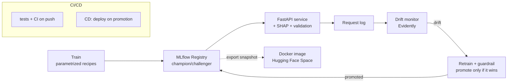

# Credit Distress — an ML system in production

An end-to-end machine-learning system that predicts a borrower's risk of financial
distress on **imbalanced** credit data — built to demonstrate *production* ML, not just
a model in a notebook. It trains, serves, explains, monitors for drift, and retrains
itself behind a safety guardrail, with CI/CD and a live demo.

> **Live demo:** _<your Hugging Face Space URL>_ · **Dataset:** [Give Me Some Credit](https://www.openml.org/search?type=data&sort=runs&status=active&qualities.NumberOfClasses=%3D_2) (150k borrowers, ~7% default)

---

## What it does



- **Handles imbalance honestly** — scored on PR-AUC (not accuracy), with class weighting and a
  cost-based operating threshold (`1/(1+K)`).
- **Serves live** — FastAPI endpoint returning a calibrated probability, a decision, and a
  per-prediction **SHAP** explanation; a browser UI renders the waterfall.
- **Trustworthy probabilities** — Platt calibration so "30% risk" means ~30% (reliability verified).
- **Explains every decision** — SHAP (auditable, sums to the prediction); LIME compared and rejected for serving.
- **Detects drift** — logs every request and compares live inputs to training with Evidently/PSI.
- **Retrains safely** — champion/challenger guardrail promotes a retrained model *only if it beats*
  the incumbent on fresh data; rollback is a one-line alias move.
- **CI/CD** — tests run on every push; a promotion triggers an automated redeploy.

## Model progression (validation PR-AUC, lazy baseline 0.067)

| iteration | change | PR-AUC |
|---|---|---|
| 01 baseline | logistic regression | 0.241 |
| 03 class weights | treat defaulters ~14× | 0.294 |
| 04 clipped | cap outliers (revived a dead feature) | 0.369 |
| 05 XGBoost | boosted trees | 0.381 |
| **v3 champion** | XGBoost **+ Platt calibration** | 0.407* / Brier 0.049 |

<sub>*test set; calibration preserved ranking while fixing probabilities (avg pred 0.31 → 0.07 = real rate).</sub>

## Repository layout

| path | what |
|---|---|
| `src/train.py` | one parametrized trainer (recipes: baseline / weighted / clipped / xgboost) |
| `src/serve.py` | FastAPI service — loads `@champion` from the registry, `/predict`, logging, SHAP |
| `src/monitor.py`, `drift_report.py` | drift detection on the live request log (Evidently) |
| `src/retrain_on_drift.py`, `auto_retrain.py` | champion/challenger guardrail + the automated pipeline |
| `src/calibrate.py`, `compare_calibration.py` | reliability curves, isotonic vs Platt |
| `src/export_champion.py` | freeze the registry champion into a deployable snapshot |
| `serving/` | **self-contained deployable service** (Docker) — app + model snapshot + UI |
| `tests/` | unit + smoke tests (guard the real bugs) |
| `docs/` | `DECISIONS.md` (14 decisions w/ trade-offs), `ROADMAP.md`, `BUGS.md` (bug journal) |
| `.github/workflows/` | `ci.yml` (tests on push), `cd.yml` (deploy on promotion) |

## Quickstart

```bash
pip install -r requirements.txt

python src/train.py all          # train every recipe, log to the scoreboard
uvicorn src.serve:app --port 8137 # serve the champion   ->  http://localhost:8137/docs
python src/monitor.py            # check the live request log for drift
python src/auto_retrain.py       # drift -> challenger -> guardrail decides
PYTHONPATH=src python -m pytest tests/ -q
```

**Run the deployable service locally** (no MLflow needed — uses the bundled snapshot):

```bash
python src/export_champion.py               # freeze @champion -> serving/
uvicorn app:app --app-dir serving --port 7860   # -> http://localhost:7860
```

## Deployment (Hugging Face Spaces)

`serving/` is a self-contained Docker app — decoupled from MLflow and the training repo, because
**serving should not depend on the tracking server**. Push it to a Docker Space (see `serving/README.md`).
`.github/workflows/cd.yml` automates this: on a promotion it exports the new champion snapshot and
redeploys — gated by the guardrail, so only a *winning* model ever ships.

## Engineering judgment (the interesting part)

The decisions and the bugs are documented, because judgment is what production experience is:

- **`docs/DECISIONS.md`** — every choice with what was rejected and why (PR-AUC over ROC-AUC;
  Platt over isotonic; serving via registry alias; boundary-level input validation).
- **`docs/BUGS.md`** — a bug journal grouped by lesson: a dead feature outliers killed under
  StandardScaler; a `None`-vs-`NaN` type mismatch that only appeared at the serving boundary; a
  drift monitor that cried wolf on thin samples. Each has the fix and *what caught it*.
- **Key lesson encoded throughout:** input drift ≠ model degradation — so retraining is gated by a
  performance guardrail, not triggered blindly.
